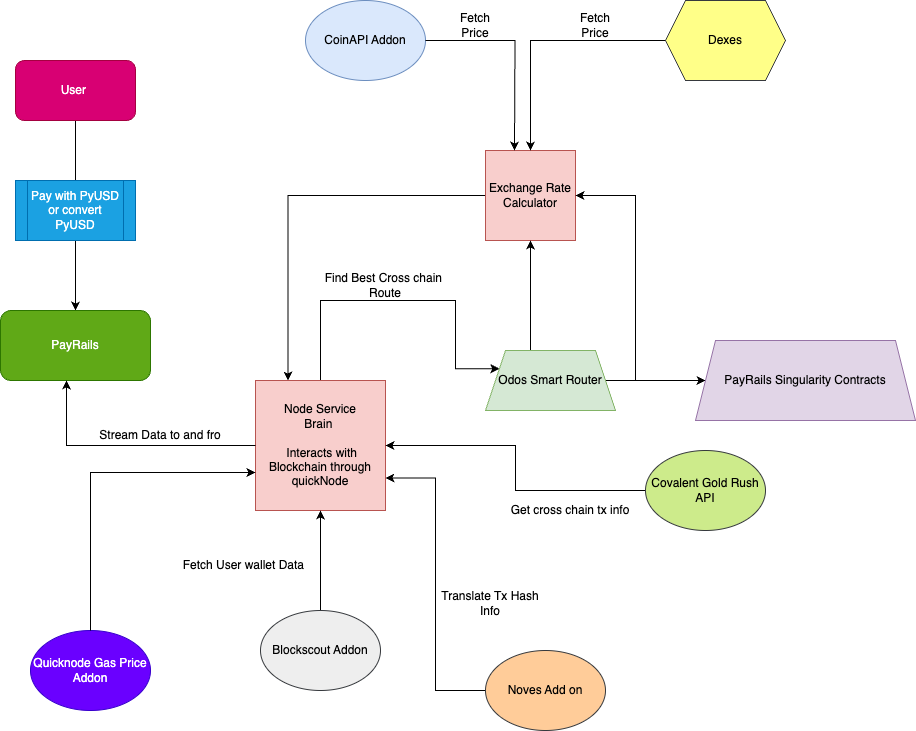

# Project Name: Payrails - Decentralized Digital Payment Solution

## Project Overview:
Payrails is a groundbreaking decentralized payment solution powered by PayPal USD (PYUSD) to address the challenges of cross-chain payments, token swaps, and on/off-ramping in a user-friendly manner. In an ecosystem where users frequently navigate between multiple blockchains, Payrails provides a streamlined, stable solution for both users and merchants to easily transact and convert tokens across networks.

## Key Features:

- Unified Payment Integration for Merchants and Users:

Merchants can integrate Payrails SDK, enabling customers to select their preferred tokens for transactions directly on the merchant's site. The SDK automatically manages token conversion, swapping, and bridging in the background, allowing merchants to accept PYUSD and other stablecoins without needing to handle cross-chain complexities.

- Easy Token Conversion and On-Ramping:

Users can convert their existing tokens (e.g., USDC, MATIC) from popular networks like Ethereum, Polygon, Arbitrum, and Avalanche into PayPal USD through a single transaction. The platform supports both gasless transactions via EIP-712 where available, and traditional gas payments where necessary, streamlining the approval process.

- Stablecoin-Driven Checkout System:

Payrails integrates directly with user wallets (e.g., MetaMask), allowing them to pay with PYUSD or swap and bridge their assets. The platform fetches token balances via QuickNode and APIs like BlockScout and CoinPub, giving users a real-time view of assets available for conversion into PYUSD.

- Efficient On-Ramp with MoonPay Integration:

Users can also purchase PYUSD using debit or credit cards via MoonPay, allowing them to avoid the multi-step process typically required for purchasing and sending PYUSD from exchanges.

- Flexible Cross-Chain Payments:

Whether users need to convert PYUSD into tokens on other networks or use their existing tokens to acquire PYUSD, Payrails offers seamless bridging and swapping, supporting transactions across Ethereum, Polygon, Arbitrum, and more.

## Technical Highlights:

- Powered by QuickNode: Real-time data fetching of token balances and chain information.
- EIP-712 Support: Gasless approvals where supported, enabling a single-click payment experience.
- Broad Token Compatibility: Users can select from tokens available on multiple chains, with automatic bridging and conversion to simplify checkout.

## User Flow:

- Connect Wallet: Users connect their wallet (e.g., MetaMask) on any merchant site integrated with Payrails.
- Select Payment Method: Users choose between paying with PYUSD or converting from other tokens.
- Seamless Approval and Payment: The platform handles conversions, approvals, and transaction submissions automatically, allowing users to pay with PYUSD in just a few clicks.

## Live Demo

Please Note:
- The live demo is available on all mainnet chains. I.E... Its on mainnet!
- Live demo may face failure due to insufficient gas funds/balance in our server so please ignore if txs fail. This is currently in testing and prototype phase. I hope you understand!

https://pay-rails.vercel.app/ETHEREUM/None/PYUSD/None
